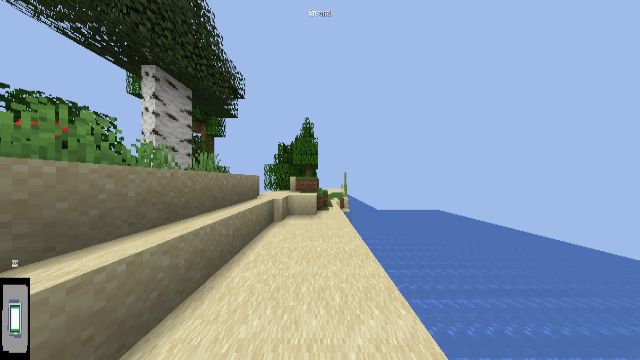
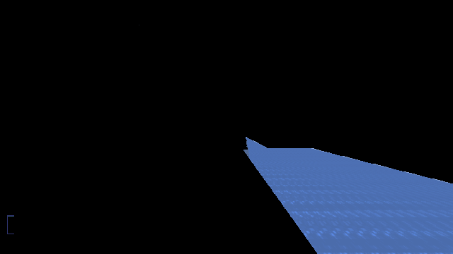

# Info

## How it started

Pork intends to reset Minecraft seeds efficiently for speedrunning. The initial approach to this project was using Python and TensorFlow Keras to feed screenshots of each instance into an image recognition machine learning model. This solution was far too inefficient for the project and did not find success in real-time usage. Once it was realized that efficiency was paramount for the project, we moved from a Python-based codebase to a Rust-based codebase. Using the Rust TensorFlow bindings the language provided didn't fit our project, so we looked for a new solution. We realized that the majority of good seeds have a high percentage of blue pixels because of their oceans. Using Opencv, we found a way to calculate this percentage of ocean pixels in python:

```python
import cv2
import numpy as np

blue_low = np.array([100, 90, 0])
blue_high = np.array([170, 255, 255])

min_blue_percent = 12

def has_ocean(file):
    img = cv2.imread(file)
    hsvImage = cv2.cvtColor(img, cv2.COLOR_BGR2HSV)
    hsvMask = cv2.inRange(hsvImage, blue_low, blue_high)
    hsvOutput = cv2.bitwise_and(img, img, mask=hsvMask)
    blue_ratio = cv2.countNonZero(hsvMask)/(img.size/3)
    blue_percent = (blue_ratio * 100)
    print(img.size)
    if blue_percent >= min_blue_percent: return True
    else: return False
```

Rust has decent Opencv bindings, through the [opencv-rust](https://github.com/twistedfall/opencv-rust) project. Using this we recreated the code in Rust:

```rust
pub fn has_ocean(&self) -> bool {
    let blue_threshold = 12.0;

    let lower_blue = Mat::from_slice(&[100.0, 90.0, 0.0]).unwrap();
    let upper_blue = Mat::from_slice(&[170.0, 255.0, 255.0]).unwrap();

    let img = imgcodecs::imread(&self.sc_dir, imgcodecs::IMREAD_COLOR).unwrap();
    let mut hsv_image = Mat::default();
    imgproc::cvt_color(&img, &mut hsv_image, imgproc::COLOR_BGR2HSV, 0).unwrap();
    let mut hsv_mask = Mat::default();

    in_range(&hsv_image, &lower_blue, &upper_blue, &mut hsv_mask).unwrap();

    let blue_ratio =
        f64::from(count_non_zero(&hsv_mask).unwrap()) / f64::from(img.size().unwrap().area());
    let blue_percent = blue_ratio * 100.0;
    println!("{:.2}%", blue_percent);
    if blue_percent <= blue_threshold {
        return true
    } else {
        return false
    }
}
```

Using that, we rewrote the project in Opencv and Rust.

## How it works

The program uses the user-defined number of rows and columns (from `conf.ini`) to divide the display into a grid. For each section of the grid, it creates an [instance object](src/instance.rs). This object has the fields x and y, which are the top left coordinates of the instance; width and height, the width `(display.width / cols)` and height `(display.height / rows)` of the instance; number, the instance number, mostly for screenshot naming; and sc_dir, the path to the instances screenshot. The idea of display.run() is to screenshot each instance, decide if the instance has an ocean or not, and then reset based on that.

```rust
pub fn run(&self) {
    for row in 1..=self.rows {
        for col in 1..=self.cols {
            let mut inst = Instance {
                x: ((col - 1) * self.width / self.cols) as i32,
                y: ((row - 1) * self.height / self.rows) as i32,
                width: self.width / self.cols,
                height: self.height / self.rows,
                number: col + ((row - 1) * self.cols),
                sc_dir: String::new(),
            };
            inst.run()
        }
    }
}
```

Although the Opencv code for ocean detection is very efficient, it's not quite fast enough. To increase efficiency, we used Rust's threading feature to open a thread for each instance to evaluate it.

```rust
pub fn run(&self) {
    for row in 1..=self.rows {
        for col in 1..=self.cols {
            let mut inst = Instance {
                x: ((col - 1) * self.width / self.cols) as i32,
                y: ((row - 1) * self.height / self.rows) as i32,
                width: self.width / self.cols,
                height: self.height / self.rows,
                number: col + ((row - 1) * self.cols),
                sc_dir: String::new(),
            };
            let inst_thread = thread::spawn(move || inst.run());
            inst_thread.join().unwrap();
        }
    }
}
```

The problem with this code is that the threads for instance evaluation don't run concurrently. `inst_thread.join().unwrap()` joins our thread back to the main thread after it's finished. Joining the thread back to the main thread is required as it's not memory safe to leave it hanging. The side effect of this code is that it halts the for loop and doesn't allow another thread to open before it's finished. This makes it so that implementing threading here is equally as efficient as our previous code. We cannot join the thread outside of the for loop because the thread is created in the scope of the for loop and cannot be called outside of it. However, there is a clever solution to this! In the line `let inst_thread = thread::spawn(move || inst.run());`, the type of `inst_thread` is not some `Thread`, it's actually a `JoinHandle`. A [JoinHandle](https://doc.rust-lang.org/std/thread/struct.JoinHandle.html), as defined by the Rust docs, is an owned permission to join a thread; it's the object we call to join a thread back to its parent thread. So to solve this issue, we declare a vector of JoinHandles before both for loops. Once we create our `inst_thread` object, we push it to the vec. Then once both for loops have been completed, we iterate through the vec and join each thread.

```rust
pub fn run(&self) {
    // Stores thread JoinHandles in thread_vec
    let mut thread_vec = Vec::<std::thread::JoinHandle<()>>::new();

    for row in 1..=self.rows {
        for col in 1..=self.cols {
            let mut inst = Instance {
                x: ((col - 1) * self.width / self.cols) as i32,
                y: ((row - 1) * self.height / self.rows) as i32,
                width: self.width / self.cols,
                height: self.height / self.rows,
                number: col + ((row - 1) * self.cols),
                sc_dir: String::new(),
            };
            let inst_thread = thread::spawn(move || inst.run());
            // Pushes JoinHandle to vec
            thread_vec.push(inst_thread);
        }
    }

    // Joins all threads in vec 
    for thread in thread_vec {
        thread.join().unwrap();
    }
}
```

### Ocean Detection

Now for the meat: how does ocean detection work? Let's call back to our `has_ocean` code (which in the repo is `instance.eval()`)

```rust
pub fn has_ocean(&self) -> bool {
    let blue_threshold = 12.0;

    let lower_blue = Mat::from_slice(&[100.0, 90.0, 0.0]).unwrap();
    let upper_blue = Mat::from_slice(&[170.0, 255.0, 255.0]).unwrap();

    let img = imgcodecs::imread(&self.sc_dir, imgcodecs::IMREAD_COLOR).unwrap();
    let mut hsv_image = Mat::default();
    imgproc::cvt_color(&img, &mut hsv_image, imgproc::COLOR_BGR2HSV, 0).unwrap();
    let mut hsv_mask = Mat::default();

    in_range(&hsv_image, &lower_blue, &upper_blue, &mut hsv_mask).unwrap();

    let blue_ratio =
        f64::from(count_non_zero(&hsv_mask).unwrap()) / f64::from(img.size().unwrap().area());
    let blue_percent = blue_ratio * 100.0;
    println!("{:.2}%", blue_percent);
    if blue_percent <= blue_threshold {
        return true
    } else {
        return false
    }
}
```

First, we define `blue_threshold`. This is the minimum percentage of blue that the screenshot must have to be determined as an ocean. We declare `lower_blue` & `upper_blue` as the lowest and highest HSV color values we define as blue. Next, we read our image, in this case `&self.sc_dir` our instance's screenshot.



After this, we convert our image from OpenCV's default colorspace BGR to HSV. We then remove all pixels that don't fall within our HSV range using the `in_range()` function.

HSV Filtered Screenshot


Screenshot Filtered for Viewing



To find the total percentage of the screen that is blue, we find the ratio of non-zero pixels in our HSV mask to the total image area. Multiplying this by 100, we have the percentage of the screen that is blue.


